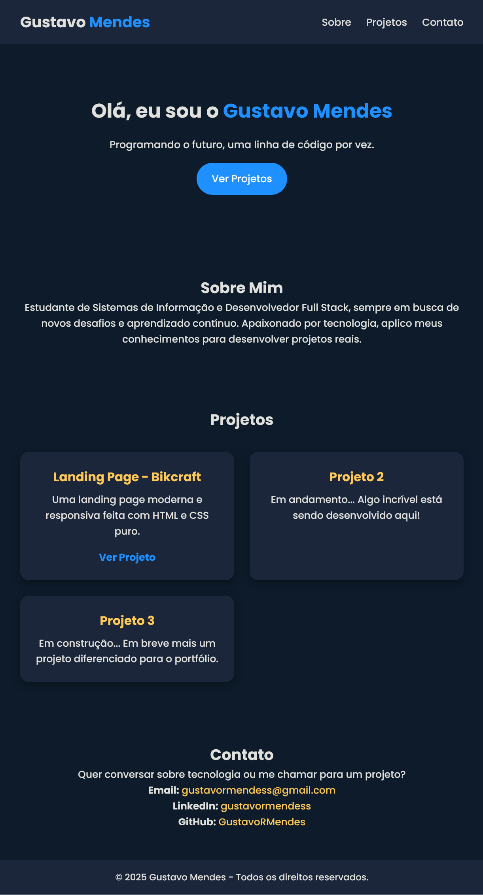

# Portfólio Gustavo Mendes
Meu portfólio pessoal, onde apresento projetos desenvolvidos em Front-End e Back-End, mostrando minhas habilidades e outras tecnologias web.

---

## ⚡ Funcionalidades
- Landing page responsiva feita com HTML e CSS puro  
- Design moderno e atraente  
- Layout totalmente responsivo para desktop, tablet e mobile  
- Seção de projetos e contato funcionando  

---

## 🛠 Tecnologias usadas
- HTML5  
- CSS3  
- Google Fonts (Poppins)
